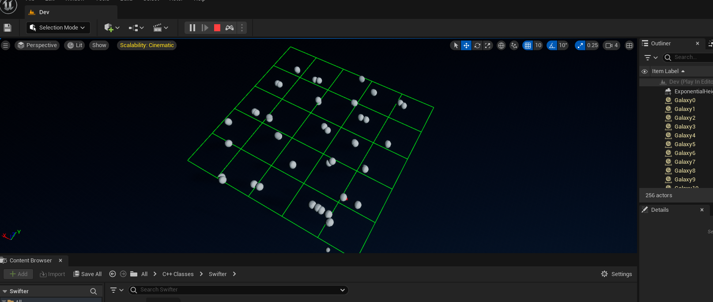
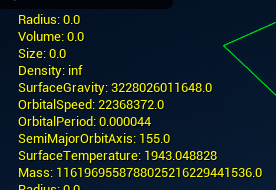
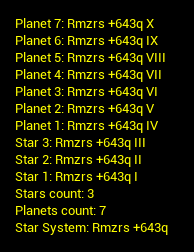
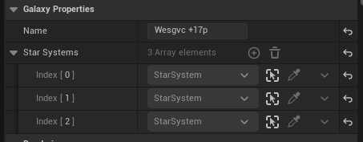
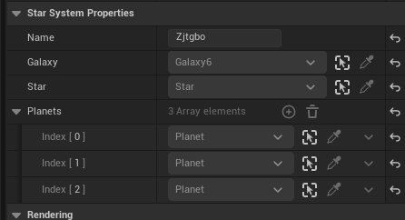
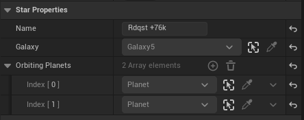
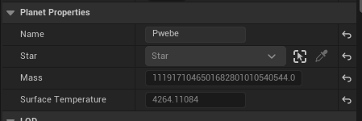

# Swifter - Universe Generator Game (Space)
A Unreal Engine 5 C++ universe generator built from scratch. Contains C++ code for:
- Solar systems
- Stars
- Galaxies
- Planets
- Universe Generator (for placing the galaxies across the world map)

### Heirarchy
Galaxies contain a random amount of solar systems, then those contain a star and a random amount of planets.

## Properties
Each celestial body has its own properties that are calculated based on my best attempts at converting real astronomic mathematic calculations into c++ code.

The calculations are based on the distance of the planet from its parent star and the size of the planet. The star calculations are based on random size and random temparature.

## Images
Galaxies sorted in grids:

Debug printing all of the planet properties:

Printing all of the planets in a generated solar system:

Galaxy properties:

Star System properties:

Some of the (public) Star properties:

Some of the (public) Planet properties:

